# NGSデータから新たな知識を導出するためのデータ解析リテラシー

This contents were originated and cloned from [https://github.com/yuifu/ajacs68](https://github.com/yuifu/ajacs68). 

AJACS68 (AJACS浜松) [https://events.biosciencedbc.jp/training/ajacs68](https://events.biosciencedbc.jp/training/ajacs68)
January 17, 2018

尾崎 遼
Haruka Ozaki
haruka.ozaki@riken.jp | http://yuifu.github.io | [@yuifu](https://twitter.com/yuifu)

理化学研究所 情報基盤センター バイオインフォマティクス研究開発ユニット 基礎科学特別研究員
Bioinformatics Research Unit, ACCC, RIKEN


----

## 概要

<!-- 本講習では、主に新型DNAシーケンサー (High-Throughput Sequencer, HTS) から得られる塩基配列データと、それに基づく生物学的データを公開しているデータベースの概要、およびデータベースからのデータの取得の手順を学びます。 -->

本講習では、NGSデータを解析するための基礎的な考え方・知識と、データ解析プロセスをどう設計・実践していくかの技術を学びます。  
ソフトウェアの使い方の詳細な解説よりも、実験系研究者が独学していくために必要なことに焦点を絞っています。

### 資料

- 紙配布資料のダウンロード http://motdb.dbcls.jp/?AJACS68
- 解析用コードへのアクセス https://github.com/yuifu/AJACS68


### Overview

- NGSは塩基を読み取る機械です
- NGS解析
  - 実験: サンプルから調整した核酸をNGSで読み取り、データを出力する
  - 情報解析: データを前処理、解析し、知識を得る

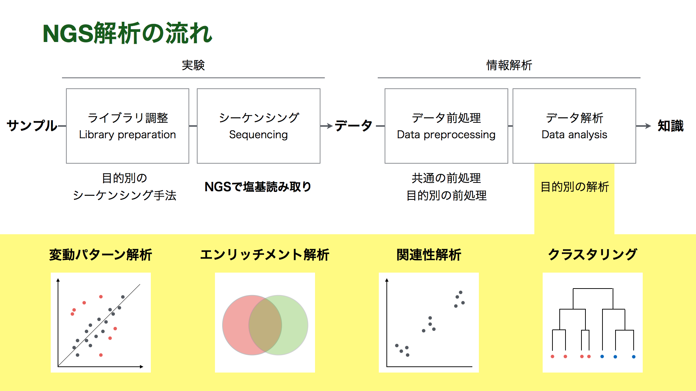

-----
----

## 講習の流れ

* 基礎
  * NGSとは何か
  * NGS解析の流れ
* 知識
  * 解析デザイン
  * データ前処理
  * データ解析
* 技術（独学の方法）
* 実習

----
----

## NGSとは何か

<!-- NGS についてはこちらが詳しい https://github.com/AJACS-training/AJACS62/tree/master/04_ohta -->

### NGSについて

次世代シーケンサー (Next Generation Sequencer; NGS) とは「サンガー法以降、2000年代中頃から登場した、新しいDNAシーケンス技術の総称」です。NGSはハイスループットな塩基配列読み取り（シーケンシング）ができることを特徴とします。「次世代」というには登場から時間が経ちすぎていることもあり、最近ではHigh Throughput Sequencer (HTS) と呼ばれることも増えてきました。

2018年1月現在でメジャーなNGSプラットフォーム（機器）としては、

- 第二世代 (塩基配列決定時に電気泳動を必要としない)
  - Illumina の HiSeqシリーズ、MiSeq, NextSeq500, MiniSeq, iSeq100
  - BGI のBGISEQシリーズ
  - Ion Torrent の Ion S5シリーズ、Ion S5 XL
  - Qiagen の GeneReader
- 第三世代（鋳型のPCR増幅が必要ない）
  - PacBio の PacBio RS, Sequel
- 第四世代（蛍光色素を使わない）
  - Oxford Nanopore MinION, GridION X5, PromethION RnD

などがあります。NGSの測定技術の詳細については、以下の文献・サイトを参照してください。

- Goodwin, Sara, John D. McPherson, and W. Richard McCombie. "Coming of age: ten years of next-generation sequencing technologies." Nature Reviews Genetics 17.6 (2016): 333-351. https://www.nature.com/articles/nrg.2016.49

### シーケンシング手法: 何を読むか

NGSはライブラリDNAができさえすればシーケンシングできます。なので、サンプルに適切な処理を施し、対象とするDNAやRNAをライブラリDNAに変換することで、多様な生命現象を網羅的に測定することができます。

<!-- NGSによって多様な生命現象を網羅的に測定して全体像を捉えることができます。 -->

| 対象分子 | シーケンシング手法 | 計測値 |
| --- | ---| --- |
| ゲノムDNA | WGS | ゲノム配列 |
| mRNA | RNA-seq | 遺伝子発現量 |
| 抗体で濃縮されたDNA | ChIP-seq | タンパク質がゲノムに結合した部位 |


例えば、ChIP-seqは、転写因子などのDNA結合タンパク質とDNAをあらかじめ架橋して断片化し、さらに免疫沈降で濃縮することで、ターゲットとするDNA結合タンパク質が結合するゲノムDNA配列を網羅的に特定する手法です。

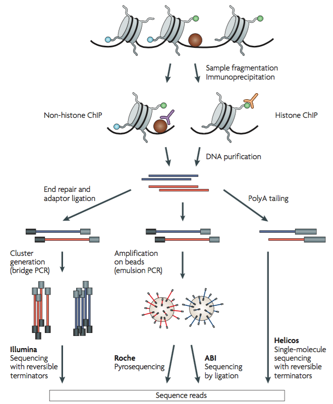

> Peter J. Park, ChIP–seq: advantages and challenges of a maturing technology, Nature Reviews Genetics (2009) doi:10.1038/nrg2641

また、RNA-seqは、細胞中のmRNAを逆転写して得たcDNA配列を（断片化して）NGSでシーケンシングすることで、遺伝子の発現量を網羅的に測定する手法です。

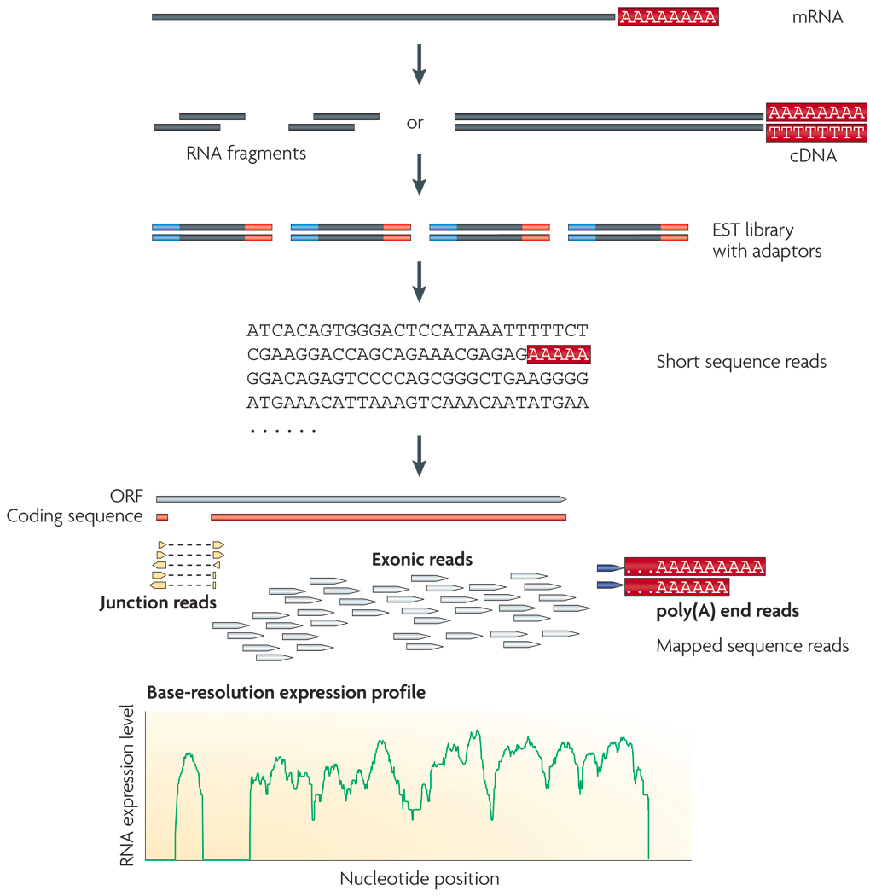

> Zhong Wang et al., RNA-Seq: a revolutionary tool for transcriptomics, Nat Rev Genet. 2009 Jan; 10(1): 57–63. doi:  10.1038/nrg2484

このような実験手法をシーケンシング手法と呼びます。各シーケンシング手法は慣例として RNA-seq、ChIP-seqのように `-Seq`と呼ばれることが多いです。シーケンシング手法が対象とする生命現象には、ゲノムやエキソンのDNA変異、遺伝子発現、RNAスプライシング、RNA修飾、RNA高次構造、ヒストン修飾、DNAメチル化、DNA-タンパク質相互作用、RNA-タンパク質相互作用、クロマチン立体構造、RNA-RNA相互作用などがあります。


NGSの登場以来、数百種類の実験手法が発表されています。これらのシーケンシング・アプリケーションの情報をまとめたサイトがいくつかあります。


- "For all you seq" Sequencing Method Posters [https://emea.illumina.com/techniques/sequencing/ngs-library-prep/library-prep-methods.html](https://emea.illumina.com/techniques/sequencing/ngs-library-prep/library-prep-methods.html)
  - PDFで一覧できる（が重い）
  - "For All You Seq—DNA", "For All You Seq—RNA", "For All You Seq—Single-Cell"
- Sequencing Method Explorer [https://emea.illumina.com/science/sequencing-method-explorer.html](https://emea.illumina.com/science/sequencing-method-explorer.html)
  - ディレクトリ型
- Enseqlopedia [http://enseqlopedia.com/enseqlopedia/](http://enseqlopedia.com/enseqlopedia/)
  - 2018年1月現在、200あまりを登録
- \*-Seq [https://docs.google.com/spreadsheets/d/14-kioo5Q9t4fer9fNAg3ezH98F0II8cH3xKA081IAzI/edit#gid=0](https://docs.google.com/spreadsheets/d/14-kioo5Q9t4fer9fNAg3ezH98F0II8cH3xKA081IAzI/edit#gid=0)
  - Google spreadsheet


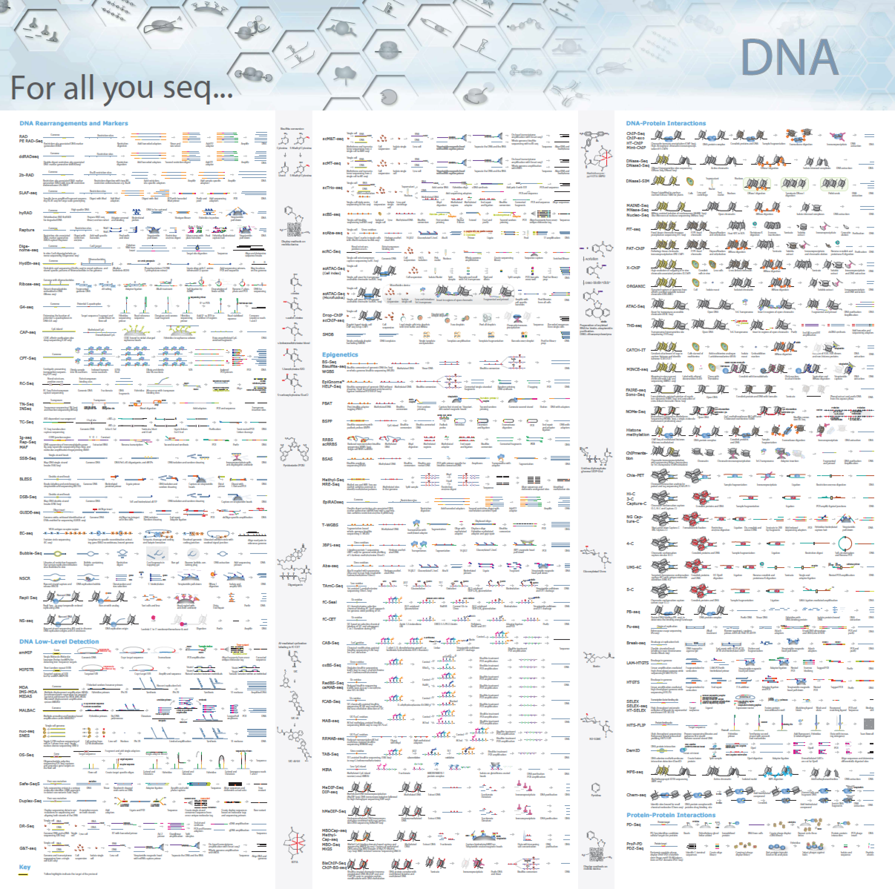
> "For All You Seq—DNA" [https://emea.illumina.com/techniques/sequencing/ngs-library-prep/library-prep-methods.html](https://emea.illumina.com/techniques/sequencing/ngs-library-prep/library-prep-methods.html)


### プラットフォーム（機器）による違い

NGSのプラットフォームによって、出力されるデータの性質に違いがあります。実際の現場では、研究の目的や予算に合わせたNGSプラットフォームが選択されます。

NGSでシーケンスされる塩基配列（リード）の長さはプラットフォームによって異なります。Illuminaなどの短いリードを出力するシーケンサーはショートリードシーケンサー、PacBioやOxford Nanoporeといった長いリードを出力するシーケンサーはロングリードシーケンサーと呼び分けることもあります。この講義では、主にIlluminaのショートリード由来のデータを想定しますが、データ解析の考え方などはロングリードのデータを扱う上でも参考になると思います。

NGSのスペックはよくリード長 (Read length)とスループット (Throughput) (１回のランで読まれる塩基対の合計) で比較されることが多いです。下のブログにまとまった情報があります（2016年7月時点）。リード長とスループットがトレードオフになっていること、各社で次々にスループットやリード長が改善していることがわかります。また、塩基読み取りエラー率にも違いがあり、現時点ではロングリードシーケンサーはショートリードよりもエラー率が高いです。


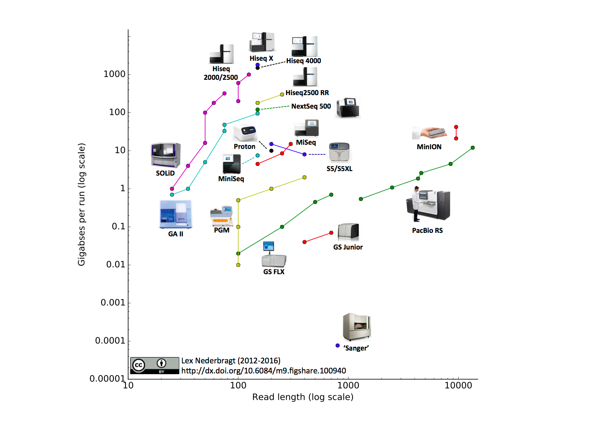

[Developments in high throughput sequencing – July 2016 edition | In between lines of code]( https://flxlexblog.wordpress.com/2016/07/08/developments-in-high-throughput-sequencing-july-2016-edition/)


2018年1月時点での最新のNGSプラットフォームのスペック比較もコミュニティでまとめられています。


[Next Generation Sequencing spreadsheet](https://docs.google.com/spreadsheets/d/1GMMfhyLK0-q8XkIo3YxlWaZA5vVMuhU1kg41g4xLkXc/edit?hl=en_GB&hl=en_GB#gid=4)


### 小まとめ


- NGSとは
  - ハイスループットなシーケンサーの総称
  - 異なるシーケンシング手法によって様々な生命現象を測定できる


-----
-----

## NGS解析の流れ

NGSを用いた研究は、ライブラリ調整 (Library preparation)、シーケンシング (Sequencing)、データ前処理 (Data preprocessing)、データ解析 (Data analysis)の４つのステップから成ります。

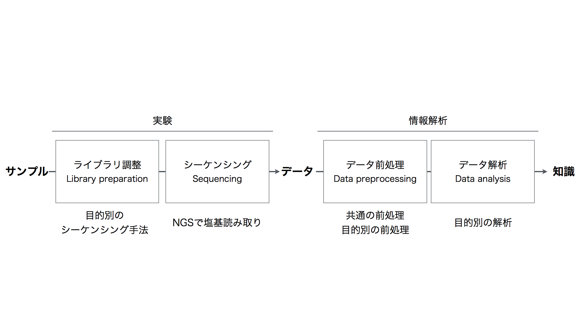


### ライブラリ調整 (Library preparation)・シーケンシング (Sequencing)
NGSはサンプルDNAを処理して得られたライブラリDNAを入力とし、DNA塩基配列データを出力します。多くの場合、サンプルDNAは断片化され、シーケンシング反応用のアダプターやプライマーを付加されてライブラリDNAとなります。

### データ前処理 (Data preprocessing)

NGSから出力される一次データ (primary data, 生データ) はこの断片化された塩基配列 (リード) の情報です。リードデータは通常FASTQ形式のファイルで保存されます。

> #### FASTQ形式
> - シーケンシングされた塩基配列と各塩基の読み取り精度 (Base quality) を記述
> - 4行で一つの配列を表す
>   1. `@`+配列のID
>   2. 塩基配列
>   3. `+`
>   4. 各塩基の読み取り精度のスコア (Quality score)
> - https://ja.wikipedia.org/wiki/Fastq
>
> ```
> @USSD-TL1-1227:179:C4E9UACXX:6:1101:12730:2322 1:N:0:GATCAG
> CTGGAAGTGTGGAAGGGAACTTAATCATTGAGTTTCTGTGAAGTATTTTGCCATCCTAAAATCCCTGAGAGTGAAACTGTTGAATCATGCTCACTTTCTT
> +
> BBBFFFFFFFFFFIIIIIIIIIIIIIIIIIIIFIIIIIIIIIIFIIIIIIIIIIIIIIIIIIIIIIIIIIIBFIIBFFFFFFFFFFFFFFFFFFFFFFFF
> @USSD-TL1-1227:179:C4E9UACXX:6:1101:12519:2371 1:N:0:GATCAG
> ATTCTCATCACGTAACACTGATGGATTCCATACCTAATTTATCAATCTAAGACATTACTGGACCACGTAACCTTACATATAACTACCTGACCATATTTTC
> +
> BBBFFFFFFFFFFIIIIIIIIIIIFIIIIIIIIIIIIFIIIIIIIIIIIIIIIIIIIIIIIIIIFIIFIIIIIIIFFFFFFFFFFFFFFFFFFFFFFFFF
> @USSD-TL1-1227:179:C4E9UACXX:6:1101:12546:2486 1:N:0:GATCAG
> GTTCCACATTGTTCTGCTGTGCTTTGTCCAAATGAACCTTTATGAGCCGGCTGCCATCTAGTTTGACGCGGATTCTCTTGCCCACAATTTCGCTTGGGAA
> +
> BBBFFFFFFFFFFIIIIIIIIIIIIIIIIIIIIIIIIIFIIFIBFIFIIIIIBFFIBFFIIIIFIIIFFFBBFFBBFBBBBBBFFBBFFBBBFFFBBBFB
> ```


リードデータはそのままでは生物学的な解釈ができません。そこで、統計検定などデータ解析を行える形にするために、生データをいくつもの段階を経て処理・加工する必要があります。同時にデータの品質管理 (Quality control; QC) も行います。そのためのステップをデータ前処理と呼びます。

まず、リードを元の塩基配列に復元する必要があります。復元の方法には大きく2つの方法があります。一つは、同じ生物種もしくは近縁種のゲノムDNAを参照するリファレンスアラインメント (マッピング) (Reference Alignment (Mapping)) 。もう一つは、出力されたリード情報のみを使うアセンブリ (Assembly) です。

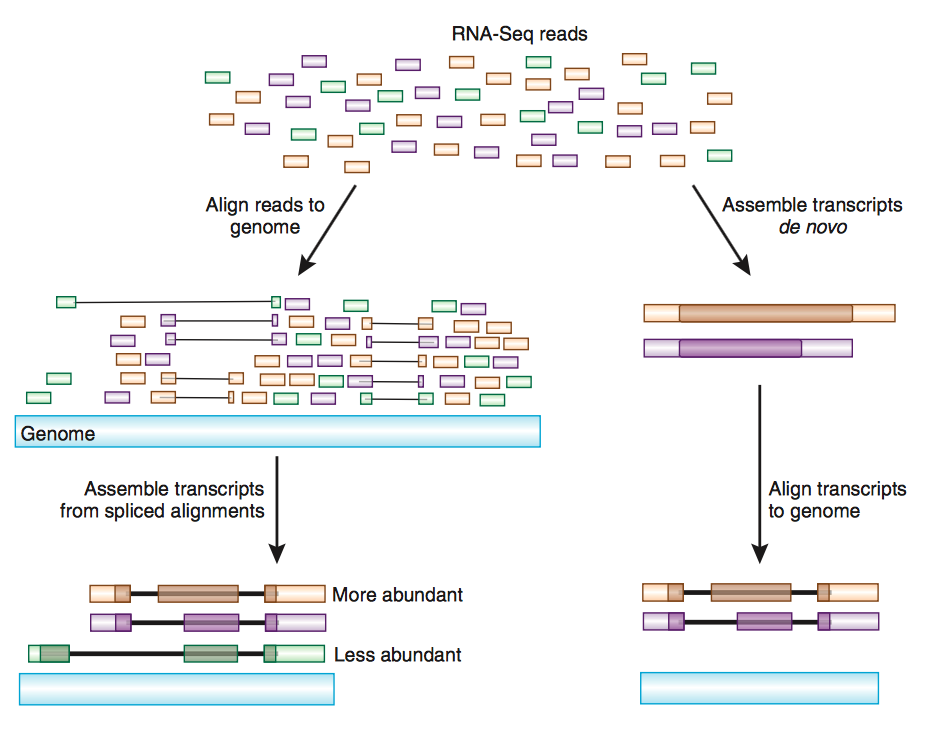  
> Haas BJ, Zody MC. Advancing RNA-Seq analysis. Nat Biotechnol. 2010 May;28(5):421-3. doi: 10.1038/nbt0510-421.

さらに、復元された塩基配列に対して、多型検出や発現量推定など、目的に応じた特徴抽出、注釈付けをおこないます。例えば、ChIP-seqならタンパク質の結合部位のゲノム上の位置のリストを作成します。また、RNA-seqなら遺伝子発現量の表を作成します。このようなステップを経ることで、データ解析ステップで使いやすいデータになります。

<!-- 何に注目してデータ化・定量化・特徴量化 (featurize) するかはデータ解析の目的により異なります。 -->
<!-- このことはNGSデータに限りません。例えば、培養細胞にある薬剤を投与した処置群と対照群の間で細胞の数の違いを検定する問題設定を考えましょう。この場合、生データは顕微鏡画像であり、顕微鏡画像が細胞数という形で特徴量を定量のは間処理に当たります。最終的には前処理を経て得られた細胞数の表を検定にかけるというデータ解析を行います。 -->

### データ解析 (Data analysis)

データ前処理で加工された前処理済みデータに対して統計検定や次元圧縮、クラスタリングなどを行います。これにより、データの特徴を明らかにしつつ、研究の目的に応じて解釈し、新規な知見を得ることができます。

<!-- ### NGS解析の多様性 -->

このように、「NGSを使う」「NGS解析をおこなう」と言っても、目的に応じて各ステップで様々な選択肢を選ぶ必要があります。様々な目的に対応できる柔軟性・拡張性がNGSの魅力とも言えます。そのため、NGSデータを解析するためには、目的をはっきりさせることが重要となります。


### NGSデータについて

NGS解析の際には様々な種類のデータ形式が登場します。データ形式は「テキスト形式かバイナリ形式か」と「仕様 (specification) (データをどのように記述するかのルール)」によって分けられます。

バイナリ形式は圧縮されたファイルフォーマットで、テキストエディタなどで内容を読むことができません。

NGSデータ解析では、塩基配列、ゲノム上の区間、アラインメント、変異といった様々な情報を記述したデータを扱います。どのファイルがどんな情報を記述しているかについて考えると理解しやすいです。


|フォーマット名| ファイル拡張子 | 情報の種類、主な用途 |
|---|---|---|
| FASTA| `.fa` `.fasta` `.mfa` | 塩基配列、アミノ酸配列 |
|FASTQ| `.fastq` | NGSから出力された塩基配列とBase quality |
| SAM/BAM | `.sam` `.bam` | リファレンスゲノム配列に対してマッピングした結果のフォーマット |
| BED | `.bed` | ゲノム上の区間、ゲノムアノテーション |
| GTF (GFF) | `.gtf`  `.gff` | ゲノム上の区間、ゲノムアノテーション |
| VCF/BCF | `.vcf` `.bcf` | DNA変異 |

> (坊農秀雄「Dr. Bonoの生命科学データ解析」, p.96, 表3.2 を改変)

また、前処理済みデータの場合、上記のような生命科学データに特有の形式だけでなく、一般的な表をコンマ区切りやタブ区切りテキストの形式 (`.txt` `.csv` `.tsv`) で保存する場合も多いです。例えば、遺伝子 x サンプルの遺伝子発現量の行列や、全サンプルのChIP-seqピークを合わせてサンプルごとの有無を記録したファイルなどが当てはまります。

<!-- さらに、名前データ、処理済みデータ、行列など、遺伝子、サンプルのメタデータなどもあります。 -->


### 小まとめ

- NGS解析はライブラリ調整 (Library preparation)、シーケンシング (Sequencing)、データ前処理 (Data preprocessing)、データ解析 (Data analysis)
  - データ前処理では、データのQCや解析しやすいようにデータの加工を行う。
  - データ解析では、研究目的に応じてワークフローが多様化する
- NGSデータは
  - NGSから出力生データから、中間データ、前処理済みデータなどいろいろ
  - ファイル形式もいろいろ


-----------------------------------
-----------------------------------


## 解析デザイン

### 計画
<!-- NGS解析の入門書や資料では、コマンドを追いがちになって各作業がどのような意味があるのかがわからないことがあります。 -->

NGSデータ解析において最も大事なことは研究目的の設定です。NGSデータ解析を始める前に（理想的には実験を開始する前に）研究の目的を明確にします。例えば、以下のような目的が挙げられます。

- スクリーニング・候補出し
  - 病気の原因遺伝子
  - ある生命現象の責任遺伝子
  - バイオマーカー（予測）
- 全体像を捉える
  - どんな遺伝子群が働いているのか知りたい
- 関係性の発見
  - ある遺伝子群とあるエピゲノム修飾の関連 (association) をみたい

次に、その目的のためにどのようなデータをどのように解析すればいいかを詰めていきます。さらに、実験・データ解析の計画を紙に描いてみると頭の中が整理されます。

- どのような仮定・仮説を置いているか
- 仮説は既存知識に照らして適切か
- 何がわかればいいか
- どのような図必要か
- 実験・解析が適切かをどのような指標で評価するか
- 結果が得られたときにどのように検証実験をするか

<!-- （polyA or total RNA） -->

### どうやって評価するか

データ解析の結果をどう評価・解釈・検証するかを考えます。先行研究などからポジコン (positive control) が知られている場合、ポジコンがとれているかが一つの評価になります。例えば、

- RNA-seqを用いた２群間での発現変動遺伝子を探索する場合、発現に差があることが既に知られている遺伝子（があれば）が、発現変動遺伝子のリストに含まれるか、といった評価が考えられます。
- 一細胞RNA-seqであれば、研究対象の細胞型に特異的な発現を示すマーカー遺伝子を知っていたとして、そのマーカー遺伝子が発現しているかも大事な評価になります。

また、NGS解析では網羅的な測定が行われるため、一度の実験でサンプルあたり多数の変数（遺伝子、ゲノム位置など）に対する測定値（遺伝子発現量、ピークの有無やリード数）が得られます。そのため、個々の変数（遺伝子、ゲノム位置など）のみならず、データを全体像として捉える視点も重要となります。例えば、

- 発現差のある遺伝子のリストにどんな機能を持った遺伝子が多いか (Gene ontology enrichment analysis など)、その遺伝子機能が既存知識と照らしてリーズナブルか。
- ChIP-seqでヒストン修飾領域を調べる場合、そのヒストン修飾がゲノム上のどのような領域に多いかの先行研究の知見と整合性があるか。

さらに、検証実験を考えておくことも大切です。重要な遺伝子の発現差をRT-qPCRで確認できるか、見つかった候補遺伝子をノックダウンして表現型をみれるかといったケースが考えられます。


### 探索的データ解析

ハンズオン講習会やチュートリアルで学ぶNGS解析のワークフローはしばしば一直線に描かれます。しかし、NGS解析に限らずデータ解析では、データ前処理とデータ解析のステップを何度も行きつ戻りつすることがあります。これは、たいていの場合、QCや可視化などを通じてデータと解析結果の観察や評価を行うと、その結果に応じて、前処理の過程を見直したり、データの加工・統合をさらに発展させたり、新たに生じた仮説を検証するデータ解析を行うことになるためです。

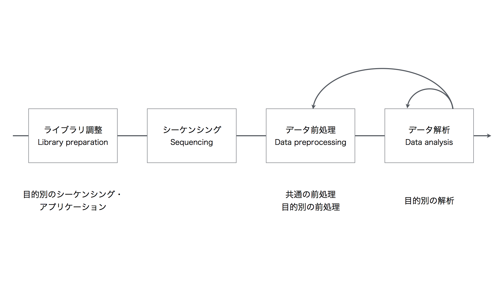

> このようなデータ解析の実践方法は John Wilder Tukey によって探索的データ解析 (Exploratory data analysis) と呼ばれています[1]。探索的データ解析ではデータから仮説を導出することが重視されます。Tukeyは、伝統的な仮説検定を中心としたデータ解析を確証的データ解析 (confirmatory data analysis) と呼び、仮説検証への偏重を批判しました。探索的データ解析では、まずデータを眺めることが重視され、種々の可視化手法でデータの特徴を観察することが重要視されます。
> [1] https://en.wikipedia.org/wiki/Exploratory_data_analysis


<!-- フレームワーク・何度もサイクルを回す -->
<!-- #### NGSデータの解析はそのデータだけでは完結しない
サンプルや変数に付随した他の情報を参照することが多いです。
例えば、比較します。クラスタリングします。どんな。
例えば、Gene ontology enrichment 解析では、発現変動遺伝子群にどのような機能を持つ遺伝子が濃縮しているかを答えます。この際には、各遺伝子という変数に付随した Gene ontology の情報を参照していることになります。
他の公開データも組み合わせて使うこともあります。 -->


### リファレンスを決める

参照ゲノム配列（reference genome sequence）や参照遺伝子アノテーション (Reference gene annotation) はNGS解析をする上で最も重要な外部データです。これらは混ぜて「リファレンス」と呼ぶことがしばしばあります。

注意すべき点は、リファレンスには作成元とバージョンがあり、作成元・バージョンが異なると通常異なる情報となることです。参照ゲノム配列であれば、ゲノム上のある区間を`chr1:111000-111199`という**座標**という形で表しますが、バージョンが異なるだけでこの区間が実際のゲノム配列の異なる位置を指し示す場合もあります。

- リファレンス配列のバージョン
  - ゲノム
    - UCSC: 染色体名が`chr`で始まる
    - Ensembl: 染色体名が数字で始まる (`chr`がない)

- 遺伝子アノテーション
  - Ensembl https://asia.ensembl.org
  - UCSC gene
  - RefSeq
  - GENCODE (ヒト、マウス)

どの遺伝子アノテーションを使うかで結果が変わることもあります[1]。目的に照らしつつ、いくつかの遺伝子アノテーションをためして、リーズナブルな結果が得られるものを選ぶという場合もあります。どれを使う場合にも、一つの研究プロジェクトの中では（特別な理由がない限り）統一するのが重要です。

[1] Zhao and Zhang, A comprehensive evaluation of ensembl, RefSeq, and UCSC annotations in the context of RNA-seq read mapping and gene quantification, BMC Bioinformatics (2015) https://bmcgenomics.biomedcentral.com/articles/10.1186/s12864-015-1308-8

----
----

## データ前処理

- リードのQC
- マッピングデータのQC
- RNA-seqの前処理・QC
- ChIP-seqの前処理・QC


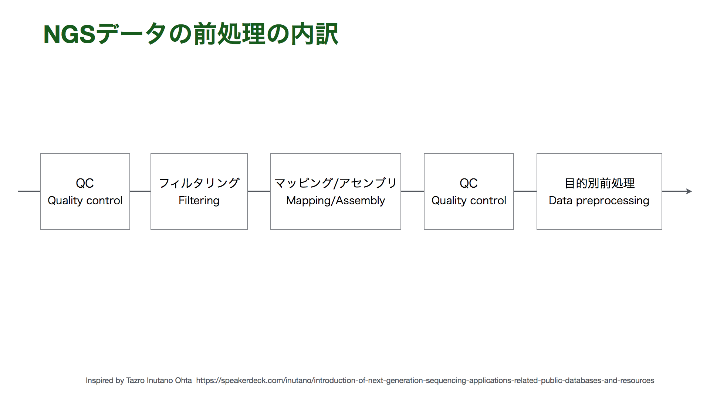


### リードのQC・フィルタリング

NGSから出力されるリードには cutadapt アダプター配列やポリA、ポリT、低クオリティのリードが含まれている場合があります。リードのデータにそのような配列が含まれていたり、その他おかしなことがないかを確認し、必要に応じてそういった配列をFASTQファイルからアダプターを取り除く必要があります。このような操作をリードのQCと呼び、特に後者ははリードトリミングやリードフィルタリングとも呼ばれます。

<!--
- アダプター配列の混入はないか？
- rRNAの混入はあるか？
- 低クオリティリードの割合
- 塩基が読めていない、読み取りエラー確率が高い -->

FASTQファイルのクオリティを確認するには、FastQCがよく使われます。チェックできるソフトウェアがよく用いられます。FastQCでは、FASTQフィイルのQCの結果HTML形式でレポートが出力されます。例えば"Overrepresented sequences"という項目には、リードデータの中で超複数の多い配列を表します。Overrepresented sequencesが出てきた場合、配列から、アダプターなど実験操作由来の外部からの配列なのか、高発現遺伝子由来の配列なのか、はたまたコンタミなのかを判断します。配列が生物由来かを見分けるにはGGGenomeを利用することができます ( http://gggenome.dbcls.jp )。


- リードのQC について https://bi.biopapyrus.jp/rnaseq/qc/
- FastQCのインストール、使い方、レポートの見方 https://bi.biopapyrus.jp/rnaseq/qc/fastqc.html

<!-- ```
# FASTQCの実行
fastqc -o <output_directiory> <fastq>
``` -->

また、リードトリミングには cutadapt がよく用いられます。cutadapt はFASTQファイルを入力として、アダプター配列を含むリードや低クオリティのリードが除去されたFASTQファイルを出力します。リードトリミングの実行後、もう一度 FastQC をかけることで、リードの品質が改善したかを確認するとよいでしょう。また、リードトリミング後のリードの数も記録しておきましょう。

- cutadapt http://cutadapt.readthedocs.io/en/stable/guide.html

なお、Illuminaのシーケンサーから出力されるリードは3'末端のクオリティが低いため、シーケンシングを実施するラボ・企業によっては予定したよりも一塩基多くシーケンシングを行うことがあります。例えば、100 bp のシングルエンドのリードを得る場合に、実際には 101 bp シーケンシングするということです。このようなデータを得た場合、3'末端の1塩基は削る必要があるので注意してください。


### マッピングデータのQC

マッピングの手段はシーケンシング手法によって異なります。例えば、
真核生物においてはRNAはスプライシングを受けるため、RNA-seq


- ゲノムへのマッピング率がサンプル間で大きく異なっていないか？
- ゲノムへマッピングされたリード数がサンプル間で大きく異なっていないか？


ゲノムブラウザ (Genome browser) による確認も重要です。ゲノムブラウザはゲノムにマッピングされたデータ (BAMなど) やゲノムアノテーション (BED, GTF, GFFなど) をゲノムの座標に沿った形で可視化するソフトウェアです。IGVはインストールしやすく、よく使われています。

- IGV http://software.broadinstitute.org/software/igv/

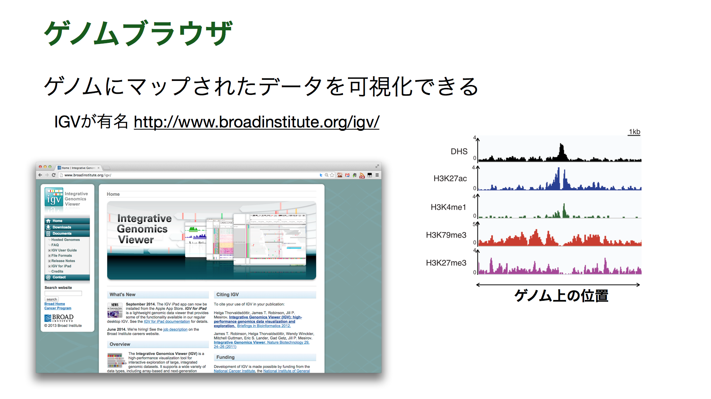


### RNA-seqの前処理・QC

RNA-seqでは通常、遺伝子 (geneまたはtranscriptのレベルで) の発現量の推定・定量が行われます。発現量定量は、ゲノム（またはトランスクリプトーム）にマッピングしたあとに発現量推定をするのが一般的でした。一方、ゲノムへのマッピングを行わない高速な手法も登場しています。

#### HISAT, StringTie, Ballgown

ゲノムへのマッピングと発現量定量には TopHat+Cufflinks が有名ですが、すでに後継のパイプライン HISAT, StringTie, Ballgown が発表されています。

HISAT2はRNA-seqのリードをゲノムにマッピングするソフトウェアです。StringTieはRNA-seqのリードをリファレンスゲノムにマッピングしたあとでアセンブリをおこなうソフトウェアです。Cufflinksより性能がよいと報告されています。アセンブリを行わず、発現量推定だけを行うこともできます。Ballgownは発現変動解析をおこなうソフトウェアです。


- HISAT2 https://ccb.jhu.edu/software/hisat2/index.shtml
- StringTie https://ccb.jhu.edu/software/stringtie/index.shtml
- Ballgown http://bioconductor.org/packages/release/bioc/html/ballgown.html
- HISAT, StringTie, Ballgown を用いたRNA-seqデータ解析のプロトコル論文 https://www.nature.com/articles/nprot.2016.095


  

> https://www.nature.com/articles/nprot.2016.095/figures/1

> ##### 「古いソフトウェアが使われ続ける」問題
>
> NGS解析ソフトウェアは次々と新しいものが開発されています。既存のタスクに対して新しいソフトウェアが開発される場合、計算時間もしくは精度が向上していることが多いため、新しいソフトウェアを用いたほうがよいということになります。一方で、現場のユーザーにとっては、資料が充実している、使い慣れている、これまでの解析結果を最> 初からやり直すのは避けたい、先行研究と比較するために互換性を保ちたいといった理由から、古いソフトウェアを使い続ける動機付けが働きます。そのため、明らかに性能の優れたソフトウェアが登場しても古いソフトウェアが使われ続けるという問題があります。この問題は近年ソフトウェア開発者らによって盛んに議論されています [1]。
>
> 例えば、RNA-seq用のマッピングソフトウェアであるTopHatの共著者のLior Pachter‏は「TopHatをも使うな」「HISAT2など後継がでている」と述べています [2]。
>
> 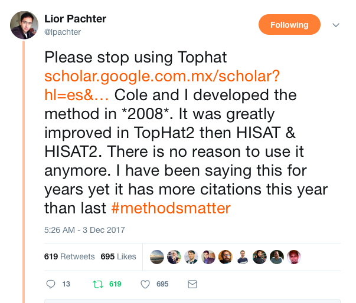
>
>
> - [1] Catherine Offord, Continue to Use Outdated Methods, The Scientist Magazine (January 9, 2018Scientists) [https://www.the-scientist.com/?articles.view/articleNo/51260/title/Scientists-Continue-to-Use-Outdated-Methods/](https://> www.the-scientist.com/?articles.view/articleNo/51260/title/Scientists-Continue-to-Use-Outdated-Methods/)
> - [2] https://twitter.com/lpachter/status/937055346987712512


#### Bowtie2/STAR + RSEM

Bowtie2やSTARはゲノムへのリードのマッピングを行うソフトウェアです。一方で、トランスクリプトームへのリードマッピングも行うことができます。RSEMはトランスクリプトームへのマッピングした結果を元に発現量推定を行います。RSEMの内部でトランスクリプトームへのマッピングソフトウェアを呼び出すことも可能です。

- Bowtie2
- RSEM https://github.com/deweylab/RSEM
  - 論文 https://bmcbioinformatics.biomedcentral.com/articles/10.1186/1471-2105-12-323

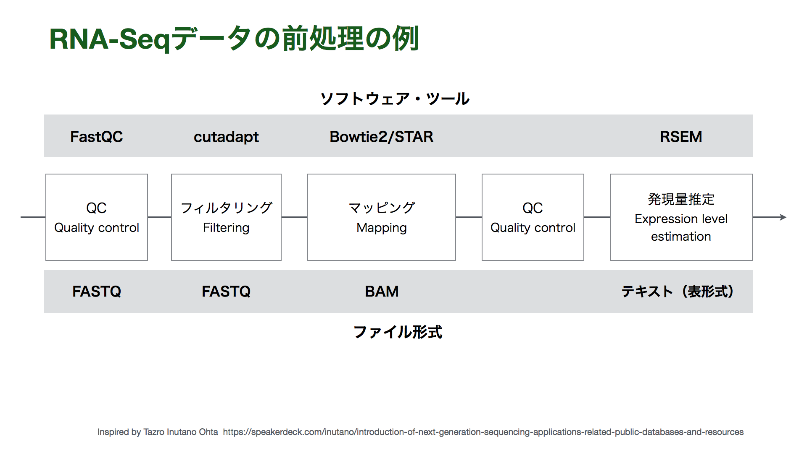


  


#### k-merベースの発現量定量

ゲノム・トランスクリプトームへのマッピングの代わりにk-merのカウントをベースにした方法を用いることで、高速にtranscriptレベルの発現量を推定するソフトウェアがいくつか登場しています。ゲノムやトランスクリプトームへのマッピングをベースとした手法では、比較的ファイルサイズの大きいBAMファイルが出力されますが、k-merベースの方法ではBAMが出力されないため（kallistoではオプションによって"pseudoalign"したSAMを出力させることができます）、ストレージを圧迫しないこともメリットです。

- sailfish http://sailfish.readthedocs.io/en/master/
- salmon https://combine-lab.github.io/salmon/
- kallisto https://pachterlab.github.io/kallisto/
  - kallisto の結果を入力に発現変動解析ができる sleuth https://pachterlab.github.io/sleuth/

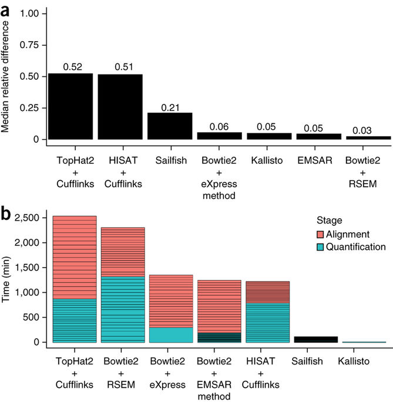

> kallisto の論文 https://www.nature.com/articles/nbt.3519 より引用


#### RNA-seqデータの発現量定量後のQC

発現量定量後によく行われるQCとして以下のようなものがあります。

- 発現量があるとされた遺伝子の数（検出遺伝子数）がどのくらいあるか
- 検出遺伝子数が極端に異なるか
    - ただし、生物学的な理由で検出遺伝子数が大きく異なる場合がある。例えば、幹細胞は分化細胞よりクロマチンがオープンな箇所が多く発現遺伝子の種類が多いことがある。
- ポジコン（マーカー遺伝子など）の発現があるか

また、発現量定量後に、さらにデータから発現量が低い遺伝子は除くことが多いです。これは、低発現の遺伝子はノイズが大きく解析に悪影響となるため、また、計算時間を短くするためです。


### ChIP-seqデータの前処理・QC

ChIP-seqデータはまずゲノムへのマッピングが必要になります。マッピング後、ピーク検出をおこなうことで、転写因子の結合部位やヒストン修飾領域のリストを得ることができます。ピーク検出はMACS2やGEMでできます。ピーク数が replicate間で特に異ならないか？


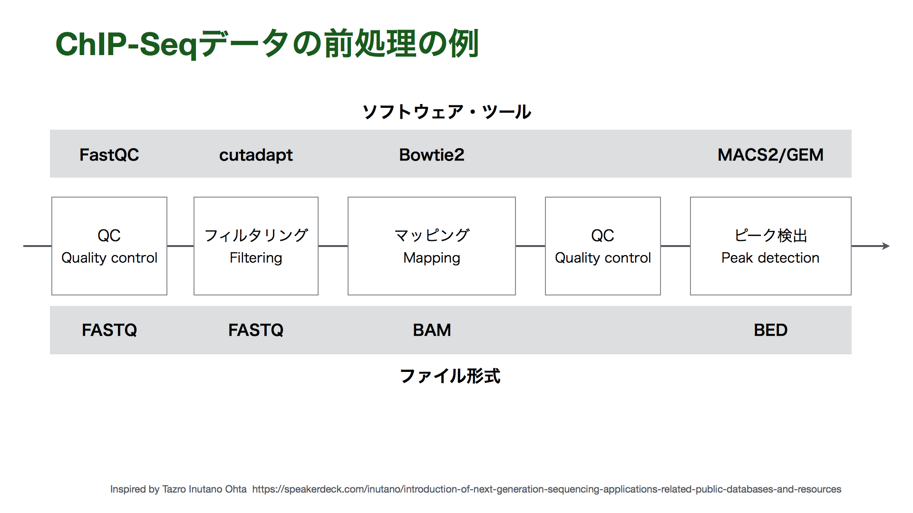

- MACS2 https://github.com/taoliu/MACS
  - MACS2の使い方はこちらの資料が詳しいです https://biosciencedbc.jp/human/human-resources/workshop/h28-2
- GEM https://groups.csail.mit.edu/cgs/gem/

ChIP-seqのピーク検出結果のQCツールとしてはIDRがあります。IDRは検出されたピークのreplicate間での再現性を評価するとともに、再現性の低いピークをフィルタリングするための統計的有意性スコアを計算します。

- IDR https://github.com/nboley/idr

また、ChIP-seqデータのQCからピーク検出、可視化までを行うツールとして、DROMPAやがあります。

- DROMPA3 https://github.com/rnakato/DROMPA3
- HOMER http://homer.salk.edu/homer/ngs/

ChIP-seqのピークのリストを得るだけでなく、遺伝子に割り当てたり、ゲノム上のどこに多いか（TSSの上流、下流、Gene bodyなど）をみることで、実験・解析がうまくいっているかの示唆が得られます。例えば、ヒストン修飾の場合は当該ヒストン修飾の機能に関する事前知識と整合するか、転写因子の場合は転写開始点に多いかなどです。このような操作はピークアノテーションと呼ばれ、ChIPpeakAnnoなどで実行できます。

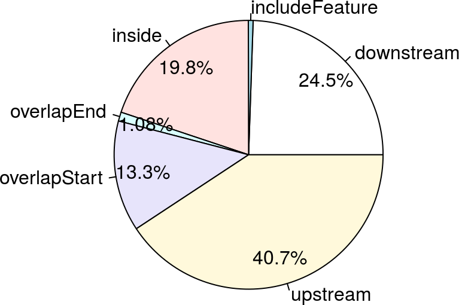
> http://bioconductor.org/packages/release/bioc/vignettes/ChIPpeakAnno/inst/doc/quickStart.html

- ChIPpeakAnno http://bioconductor.org/packages/release/bioc/html/ChIPpeakAnno.html

また、転写因子ChIP-seqでは幅の狭い領域に結合部位が限局します。そのようなデータに対してDNAモチーフ解析をすることで、対象とする転写因子のモチーフが既知である場合に、ちゃんとそのモチーフが取れるかも評価指標となります。

- DREME http://meme-suite.org/doc/dreme.html
- HOMER http://homer.salk.edu/homer/ngs/
- rGADEM https://bioconductor.org/packages/release/bioc/html/rGADEM.html


### 小まとめ

- リードのQC
  - FastQC
  - リードトリミング
- マッピングデータのQC
  - マッピング率・リード数の確認
  - ゲノムブラウザによるマッピングの確認
- RNA-seqの前処理・QC
  - HISAT, StringTie, Ballgown
  - Bowtie2/STAR + RSEM
  - k-merベースの発現量定量
  - 検出遺伝子数・ポジコンの確認
  - 低発現遺伝子の助教
- ChIP-seqの前処理・QC
  - ピーク検出
  - ピークアノテーション
  - モチーフ検出


<!-- ### QC, 要約統計量（データの性質を知る）

数をみたり、〜〜〜 -->


-----
-----


## データ解析

- 変動パターン解析
- エンリッチメント解析
- 層別・関連性・重なりの解析
- 次元圧縮・クラスタリング
- リード分布を集合的に眺める
- データの統合（IDによる統合、ゲノム上の位置による統合）

### 変動パターン解析

NGS解析では複数の条件間で比較することが多いです。二群の差、時系列パターン、群特異的遺伝子など、実験デザインによって様々なですが、特定の変動パターンを持った変数（遺伝子、ピークなど）を統計学的手法やデータマイニング的手法で検出します。これは変動パターンがなんらかの機能を示唆する、という仮定に基づくものです。

EdgeR は古典的なソフトウェアですが、一般化線形モデルや加法モデルが使えるため、多様な実験デザインに対応しています。

- EdgeR http://bioconductor.org/packages/release/bioc/html/edgeR.html


### エンリッチメント解析

遺伝子や転写因子結合部位のリストが得られた時、一つ一つを詳細に調べるのも重要ですが、全体像を理解することも重要です。特に、どのような性質を持った要素がリストに含まれているのかを知るのがエンリッチメント解析です。

よく使われるのが、遺伝子機能のエンリッチメント解析です。MetaScapeはウェブサービスで使いやすいです。

- MetaScape http://metascape.org/gp/index.html
    - 入力: 遺伝子リスト
    - 出力: リストの遺伝子群に濃縮する機能
    - 統合TVの資料 http://togotv.dbcls.jp/20160927.html

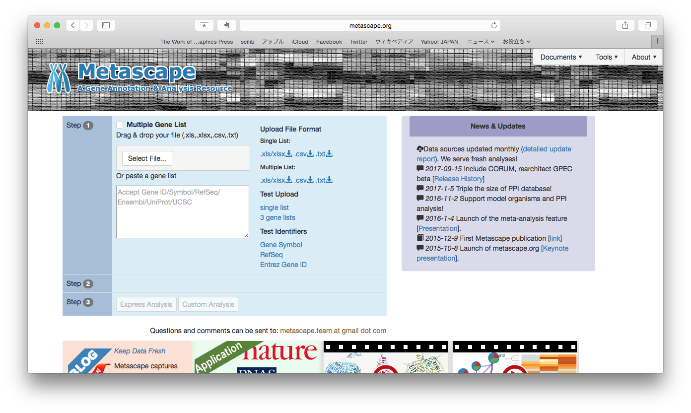

また、ChIP-seqから得られたゲノム領域のリストを入力とすることもできます。GREATというウェブサービスでは、入力のリスト中のゲノム領域を近傍の遺伝子に割り当てて遺伝子機能のエンリッチメント解析を行います。

- GREAT http://great.stanford.edu/public/html/
  - 入力: ゲノム領域のリスト（ChIP-seqのピークのリストなど）
  - 出力: 近傍遺伝子に濃縮する機能

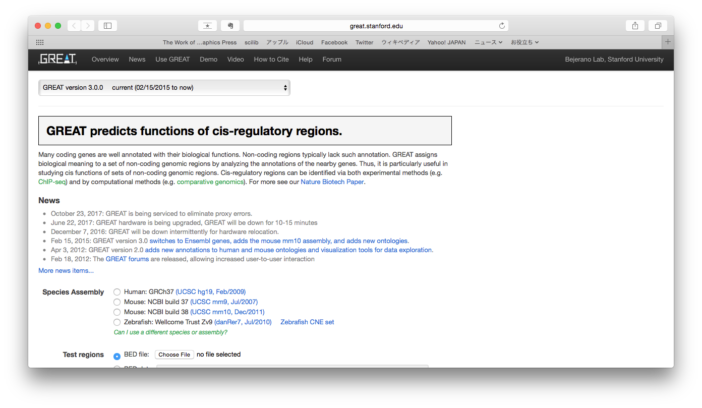


### 層別・関連性・重なりの解析

変動パターンで層別した遺伝子群やピーク集合がどんな特徴を持つか、群間で何か特徴が異なるかに興味がもたれます。例えば、以下の様な形が考えられます。このような違い

- 転写因子Aと転写因子Bの結合部位が重なる場所はどのくらいか
- 転写因子A/B単独の結合部位に比べて異なる特徴はあるか
- TSSからの距離の分布に違いがあるか
- ChIP-seqタグ数に違いがあるか
- 近くの遺伝子の発現量変化や発現量の絶対値に違いがあるか
- 濃縮するDNAモチーフに違いがあるか

また、２つの特徴（遺伝子群同士、ピーク集合同士など）の重なりが統計学的に有意かを検定するのに、Fisherの正確確率検定 (Fisher's exact test) や超幾何分布検定 (Hypergeometric test) がおこなわれます。さらに、数千のゲノムアノテーションファイルを対象に、手持ちのゲノム領域のリストが有意に大きな重なりがあるかを調べるツールとしてGIGGLEがあります。例えば、手持ちのBEDファイルやVCFファイルがあるときに、ENCODE projectやRoadmap Epigenome project、FANTOM5といったコンソーシアムとの重なりを一気に調べられます。ChIP-seqデータの二次データベースであるChIP-atlasでもこのような解析ができます。

- GIGGLE https://github.com/ryanlayer/giggle
  - こちらの日本語解説記事が詳しい https://qiita.com/yuifu/items/f8a87658724c3c83900f
- ChIP-atlas http://chip-atlas.org

### 次元圧縮・クラスタリング
似たものをまとめる操作をクラスタリングと呼びます。クラスタリングはサンプル方向の場合と変数（遺伝子、ピークなど）方向の場合があります。クラスタリングによって、データに既存知識との整合性があるか、あるいは、これまで知られていないかったもの同士のつながりが示唆される場合があります。例えば、

- 共発現する protein-coding RNA と long non-coding RNA は共通の生物学的プロセスに寄与するかもしれない (Guilt-by-association)
- replicate同士が近くにクラスタリングされていることはデータの信頼性を表すかもしれない

一般的な階層的クラスタリング用いられる場合があります。また、WGCNAのような共発現ネットワークを描いてから遺伝子をクラスタリングする手法もあります。

- WGCNA https://labs.genetics.ucla.edu/horvath/CoexpressionNetwork/Rpackages/WGCNA/

高次元のデータを低次元空間に射影することでデータ間の関係を明らかにする手法として次元圧縮 (Dimensional reduction)があります。線形な変換をおこなうPCAやICA、非線形な変換を行うMDS、Diffusion map、t-SNEなどがあります。PCAは昔からマイクロアレイの時代から発現データの次元圧縮に使われています。また、一細胞RNA-seqデータの解析では、多数の細胞型を分けたり細胞系譜を再構築するためにt-SNEやdiffusion mapがよく用いられます。

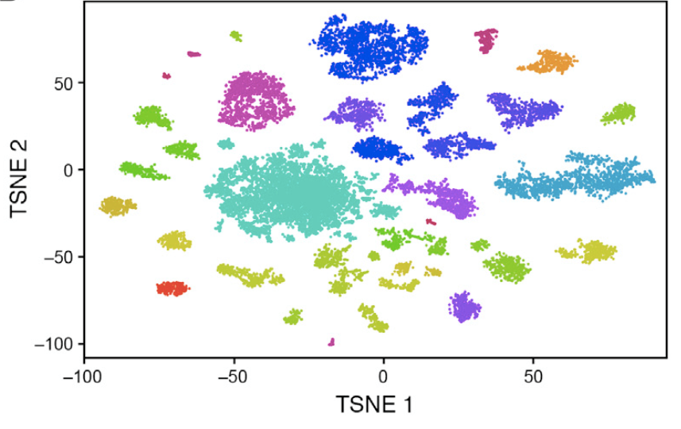
> t-SNEによる一細胞RNA-seqデータの可視化
> Macosko, Evan Z., et al. "Highly parallel genome-wide expression profiling of individual cells using nanoliter droplets." Cell 161.5 (2015): 1202-1214.

- 次元圧縮手法についてはこちらが詳しい http://www.slideshare.net/mikayoshimura50/150905-wacode-2nd


### リード分布を集合的に眺める

リードの分布を集合的に眺めることで、mRNA量（RNA-seqの場合）やヒストン修飾や転写因子結合部位（ChIP-Seqの場合）がどのように分布しているかについての知見を得ることができます。主なものにHeatmap, Aggregation plot, Meta-gene plot があります。

- Heatmap: 領域周辺のリード分布を縦（が多い）に並べて一覧できるように表示
- Aggregation plot: ゲノム上の部位（点）の周辺のリードの分布を平均化して表示
- Meta-gene plot: ゲノム上の区間（遺伝子領域 (gene body) など）について、その長さをそろえた上で周辺のリードの分布を平均化して表示

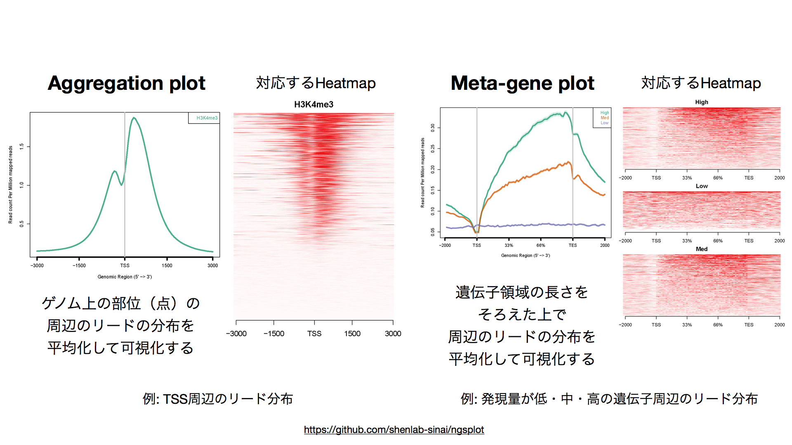

ゲノム上の全TSS、全遺伝子、ChIP-seqピーク領域について可視化することで、解析しているデータの測定対象の特徴が既存知識と齟齬がないかについて確認することができます。さらに、領域・遺伝子をグループ分けしてグループごとにリードの分布を可視化することで、グループ間でのリード分布を比較することができます。例えば上の例では、発現量に応じてグループ分けした遺伝子群（High, Medium, Low）ごとにMeta-gene plotを作成することで、H3K4me3という転写活性化型のヒストン修飾が発現量が高い遺伝子群で多くなっていることがわかります。

上のような可視化を行うソフトウェアとして deepTools や ngs.plot があります。

- deepTools http://deeptools.readthedocs.io/en/latest/
- ngs.plot https://github.com/shenlab-sinai/ngsplot


### データの統合

NGSデータの解析結果が得られたあと、その結果を別のデータセットの解析結果や外部のデータベースの内容と統合することで、単独のデータだけでは見えなかった知見が明らかになる場合があります。そのような目的のためには「データの統合」が必要となります。データの統合は主に「IDによる統合」と「ゲノム座標による統合」があります。

- 詳しくは 「Dr. Bonoの生命科学データ解析」の5.6節を参照

#### IDによる統合

異なる遺伝子リストや異なるデータセットの複数の発現量行列を遺伝子IDでひも付けたいとしましょう。そのような操作を一般にJOINといいます。Rの `dplyr`パッケージを使うとJOINがスムーズにできます。

- `dplyr`によるJOINはこちらが詳しい https://qiita.com/matsuou1/items/b1bd9778610e3a586e71

なお、異なるデータベース間でIDによる統合をしようとすると、IDの変換が必要となります。Ensembl の BioMart を使うとデータベース間でのIDの変換がスムーズです。

- BioMartの使い方はこちらの動画が参考になります http://togotv.dbcls.jp/20110927.html


#### ゲノム上の位置による統合

ゲノム上の位置が近い特徴同士はなんらかの関連がある場合があります。例えば、転写因子の結合部位が遺伝子の近くにある場合、その遺伝子の発現量の変動データと統合して解析することで、転写因子の機能についての示唆を得られます。

ゲノム上の位置によって異なるデータを統合するには bedtools が便利です。bedtoolsは BEDフォーマットを操作するコマンドラインツール群です。`intersectBed` や `windowBed` によって近くのゲノム領域（ピークなど）同士を紐づけることができます。

- bedtools http://bedtools.readthedocs.io

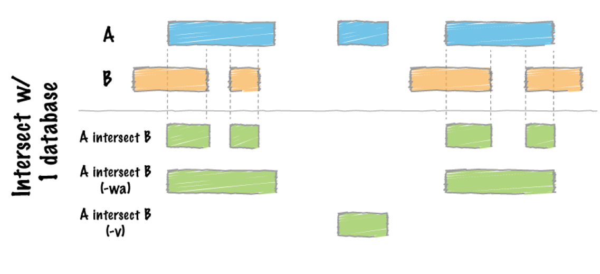

### 小まとめ

- 変動パターン解析
- エンリッチメント解析
- 層別・関連性・重なりの解析
- 次元圧縮・クラスタリング
- リード分布を集合的に眺める
- データの統合（IDによる統合、ゲノム上の位置による統合）


----------------------------------------------
----------------------------------

## 技術（独学の方法）

NGSデータ解析に必要な知識と技術には、汎用性の高いものと生命科学系データ（NGSデータを含む）特有のものがあります。それぞれをどう独学で学ぶかを見ていきます。

* NGS解析の選択肢
* NGS解析の３つの壁
* NGS解析の勉強
* UNIXコマンドラインの勉強
* スクリプト言語の勉強
* Rの勉強
* トラブルシューティングの勉強

### NGS解析の選択肢

NGSデータ解析をどう進めていくかには、利用可能な時間とお金、およびどこまで深く解析するかによっていくつか選択肢があります。

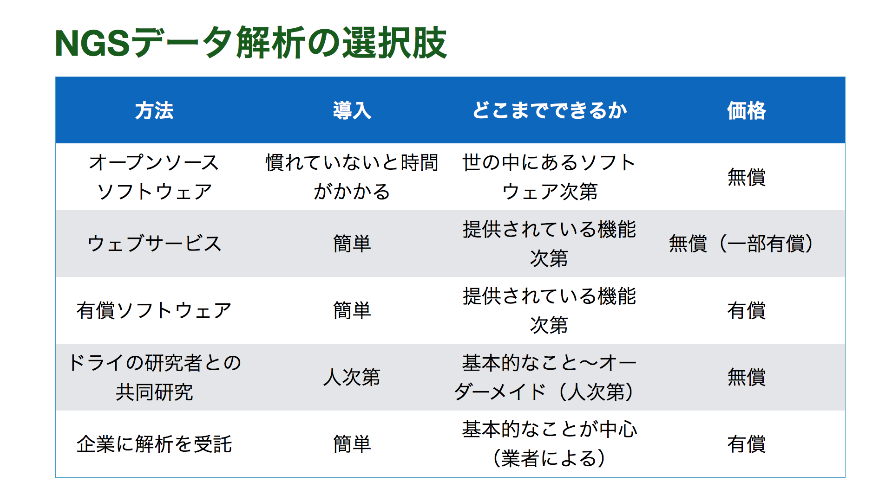

また、ウェブサービス, GUI, CUIという区別も重要です。GUIはグラフィカルユーザーインターフェースの略で、パソコンを使うときにクリックなどで使うことができるインターフェースです。CUIはキャラクターユーザーインターフェースの略で、文字ベースでUNIXコマンドラインでの操作が必要になります。ウェブサービスやGUIに比べ、CUIでは利用できるソフトウェアの種類数が多いこと、自動化やスパコンによる計算などスケールしやすいことがメリットとなります。

| | メリット | デメリット |
| -- | -- | --|
| ウェブサービス | インストール不要 | ウェブサービスは作るのが面倒なので、できることがCUIに比べて限られる。ファイルサイズが大きいデータの処理が困難な場合が多い。 |
| GUI | 操作が楽 | GUIは作るのが面倒なので、できることがCUIに比べて限られる。 |
| CUI | ソフトウェアの種類が多く、できることが増える。スクリプト化による自動化が可能。 | UNIXコマンドラインの習得が必要。 |

#### Galaxy
Galaxy はウェブベースのNGSデータ解析環境です。

- Galaxy https://usegalaxy.org
- 使い方などは以下を参照
  - http://www.ddbj.nig.ac.jp/wp-content/downloads/ddbjing/28ddbjing_yamaguchi.pdf
  - https://galaxy.dna.affrc.go.jp/nias/static/howtouse.html
  - https://github.com/inutano/training/tree/master/ajacs-advanced-01

### NGS解析の３つの壁

- バイオインフォのドメイン知識の壁
  - → バイオインフォ、NGS解析の知識の勉強で乗り越えられる
- CUIの壁
  - → UNIXコマンドライン、スクリプト言語、Rの習得で乗り越えられる
- トラブルシューティングの壁
  - → トラブルシューティングの方法を覚えることで乗り越えられる


<!-- ### 道具立て

* UNIXコマンドライン
* スクリプト言語
* R
* bedtools, samtools -->


### NGS解析の勉強


1. 研究目的、NGS解析で何を明らかにしたいのかを決める
2. 自分のやりたいNGS解析についてサーベイする
    - 「バイオインフォマティクス人材育成のための講習会」の中で、研究目的に関連する箇所のスライド・動画をみる https://biosciencedbc.jp/human/human-resources/workshop
    - 「次世代シークエンス解析スタンダード」の目次に目を通し、研究目的に関連する箇所を通読する https://www.yodosha.co.jp/yodobook/book/9784758101912/
    - 「次世代シークエンサーDRY解析教本」の目次に目を通し、研究目的に関連する箇所を通読する http://gakken-mesh.jp/book/detail/9784780909203.html
        - 統合TVで「次世代シークエンサーDRY解析教本」と検索し、講義動画を眺める http://togotv.dbcls.jp
    - 「シングルセル解析プロトコール」の目次に目を通し、研究目的に関連する箇所を通読する https://www.yodosha.co.jp/yodobook/book/9784758122344/
1. 「Dr. Bonoの生命科学データ解析」を読む https://www.medsi.co.jp/books/products/detail.php?product_id=3588
    - NGSデータはNGSデータだけでなく、多様な生命科学型データベースの情報と比較することが多い。そのため、一般のバイオインフォについて知ることが重要となる。


#### NGSデータの取得

- 自分でNGSデータを取得する
- 公共データベースから取得する
  - NGS由来の配列データの取得
    - SRA
    - ENA
    - DRA
  - 前処理済みデータの取得
    - 遺伝子発現
      - GEO https://www.ncbi.nlm.nih.gov/geo/
      - RefEx http://refex.dbcls.jp
    - エピゲノム
      - ChIP-Atlas http://chip-atlas.org
      - Cistrome database http://cistrome.org/db/
    - メタゲノム
      - EBI metagenomics https://www.ebi.ac.uk/metagenomics/
  - 大規模データ生産プロジェクト
    - ENCODE project https://www.encodedcc.org
    - IHEC http://ihec-epigenomes.org
    - GETx project https://www.gtexportal.org


### UNIXコマンドラインの勉強

NGSデータを取り扱うためにはUNIXコマンドラインを道具として使う必要があります[1]。UNIXコマンドラインは文字（Character）ベースのユーザインタフェース（Character User Interface：CUI）です。一方、パソコンなどを使うときに目にするのはグラフィカルユーザーインターフェース（Graphical User Interface：GUI）です。

GUIでできるに越したことはないですが、実際はCUIでやったほうが便利な場合が多いです。それには、(1) NGSデータのような数-数十GBのデータを扱うには、GUIでは処理する効率が悪かったり、事実上不可能な場合がある、(2) 同じ処理を異なるファイルに対して何度も実行するとき、スクリプト化すればミスなく繰り返せる、(3) スパコンやクラウドといった外部の計算機資源を使うにはCUIで操作する必要がある、といった理由があります[1]。

> [1] 坊農秀雄「Dr. Bonoの生命科学データ解析」, 第３章


1. 坊農秀雄「Dr. Bonoの生命科学データ解析」の第３章を通読する
    - UNIXコマンドラインでできることが簡潔にまとまっている
1. UNIXコマンドラインを使える環境を構築する
    - Mac, Linux であればターミナルを開けばよい
    - Windows の人はLinux環境を構築する http://cmdline.2016.class.kasahara.ws の「Linux環境をWindows上に構築したい人へ」というスライドと「ゲノム情報解析のために Windows 上で Linux 環境を構築したい人へのイントロダクション」という動画を参考にする
2. 「コマンドライン講習会」 http://cmdline.2016.class.kasahara.ws の動画をその１からその４までみる（スライドも参照）
    - 自分の環境で試しながら聴くと理解が深まる
    - （たった5-6時間で一生使える技術が身につく！）


### スクリプト言語の勉強

スクリプト言語はプログラミング言語。スクリプト言語が使えるようになると、簡単な文字列処理、データ加工などができるようになります。シェルスクリプト、Perl、Python、Rubyなどが有名です。

1. https://biosciencedbc.jp/human/human-resources/workshop/h27 のスクリプト言語（シェルスクリプト、Perl、Python）の資料と動画をみる


### Rの勉強

Rは統計検定やデータの可視化などに強いプログラミング言語です。Rのメリットとして、統計解析や可視化のパッケージが多数利用可能であること、広く使われているためサポート情報・コミュニティの情報・日本語の情報が充実していることが挙げられます。

<!-- - データの加工: `tidyverse`
- 図示:
- 統計検定 -->

また、 Bioconductor の存在も重要です。Bioconductor は生命科学系のRパッケージに特化したレポジトリ（パッケージの集積場所）です。EdgeRなどNGS解析でよく使われるパッケージもBioConductorからインストールすることができます。

- Bioconductor https://bioconductor.org

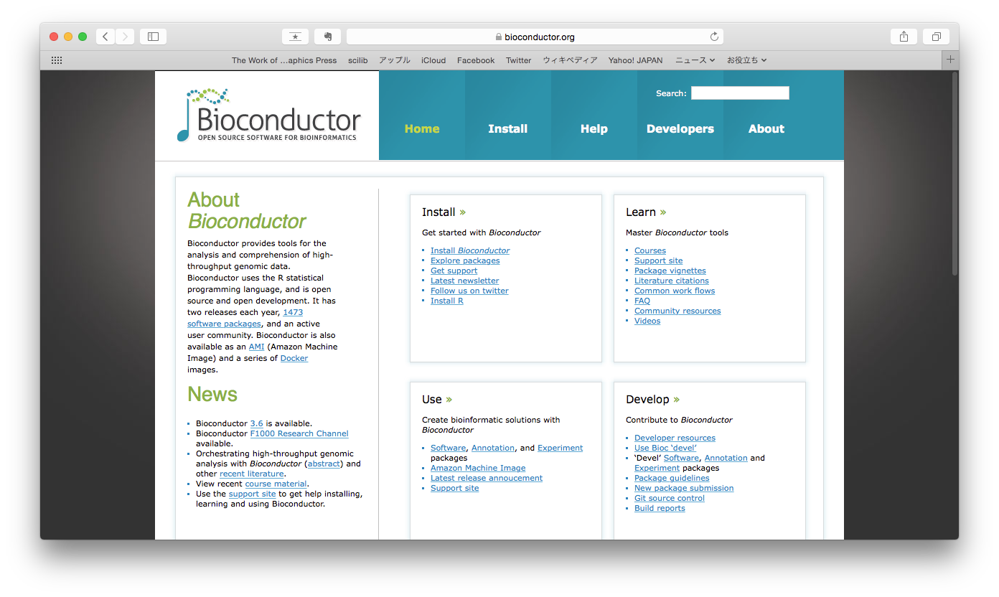


さらに、最近は`tidyverse`もデータ解析に便利です。`tidyverse`は整理されたインターフェースを目指したRパッケージ群です。生命科学系のみならず、アカデミア・企業を問わず一般の様々なデータ解析の現場で使われています。

- `tidyverse` https://www.tidyverse.org
  - 詳しくはこちらの日本語記事がわかりやすいです https://www.slideshare.net/yutannihilation/tidyverse
  - データ読み込み: `readr`
  - データの前処理: `tidyr`
  - データの加工: `dplyr`
  - データの可視化: `ggplot2`
  - パイプ（コードが見やすく直感的にかける）: `magrittr`
- `dplyr`, `tidyr`, `ggplot2` はこちらのチートシート（早見表）が便利です。
  - `dplyr` と `tidyr` のチートシート: https://www.rstudio.com/wp-content/uploads/2015/09/data-wrangling-japanese.pdf
  - `ggplot2` のチートシート: `https://www.rstudio.com/wp-content/uploads/2015/08/ggplot2-cheatsheet.pdf`


#### Rを使うインターフェース

Rを使うインターフェースにはいくつかの選択肢があります。
<!-- 操作の簡便さと導入のしやすさから、初学者にはRStudioをおすすめします。 -->

|名前|使用感|導入|
|--| ---| --|
| REPL | ターミナルから操作する | Rをインストールすればすぐ使える |
| RStudio | スクリプトを書きながら実行できる、便利な機能がGUIで使える | 比較的楽 |
| Jupyter notebook | ウェブブラウザで使える、スクリプトを書きながら実行できる、実行結果がそのまま残る |コマンドライン初学者には少し難しいかも |


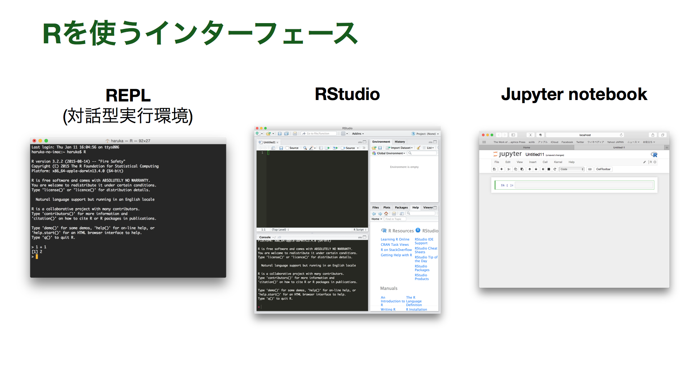

- RStudio https://www.rstudio.com
- Jupyter notebook http://jupyter.org


#### Rのパッケージのインストール

まとまった機能を持ったコマンド群をパッケージと呼びます。もともとインストールされている場合もありますが、統計解析や可視化手法、NGS解析に特化したツールは新たにインストールする必要がある場合があります。

パッケージを配布するために集積する場所をレポジトリと呼びます。Rパッケージの代表的なレポジトリはCRANです。またBioconductorは生命科学系のデータ解析用のパッケージに特化したレポジトリです。また、R言語に限らず汎用的なレポジトリとして GitHub もあります。

- CRAN https://cran.r-project.org
  - `install.packages()` という関数を用いてインストールする
- BioConductor https://www.bioconductor.org
  - `biocLite()` という関数を用いてインストールする
- GitHub https://github.com
  - あらかじめ `devtools` パッケージをインストール、ロードした上で、`install_github()`

RStudioでのパッケージのインストールについてはこちらを参照してください https://github.com/yuifu/ajacs68/blob/master/Tutorial_install_R_packages.md


#### Rの習得

RはRStudio を使うと便利です http://www.rstudio.com

1. RStudio の使い方の動画をみる http://togotv.dbcls.jp/20170512.html
    - MacOSX版だがだいたい同じ
2. R と RStudio をインストールする
3. https://biosciencedbc.jp/human/human-resources/workshop/h27 のR基礎1, R基礎2 の動画とスライドをみる
4. https://biosciencedbc.jp/human/human-resources/workshop/h27 のR各種パッケージ, Bioconductorの利用法１, Bioconductorの利用法２の動画とスライドをみる
4. `tityverse`
    - https://www.datacamp.com/courses/introduction-to-the-tidyverse の "Data wrangling" をみる
    - https://www.datacamp.com/courses/data-visualization-with-ggplot2-1 の "Introducton" をみる
    - Heavy Watal https://heavywatal.github.io も参考になります


### トラブルシューティングの勉強

ソフトウェアを動かすとしばしばエラーが出ます。エラーが出たら、落ち着いてエラーメッセージ（たいてい英語）を読みましょう。エラーに対処するヒントが書いてあることがあります。

また、エラーメッセージをGoogle検索してみることも有効です。同じようなエラーに遭遇した人が解決法を発見していることがあります。

人に聞いてみることもいいでしょう。例えば以下の方法が考えられます。その際には、(1) ソフトウェアの名前とバージョン、(2) ソフトウェアを動かした、(3) 何をしようとしたかの説明、(4) どんなエラーメッセージが出たか、を書くとスムーズです。

- 作者に聞く（メール、GitHubのissueなど）
- QAサイト（質問サイト）で質問する
  - Biostars (英語) https://www.biostars.org
  - SEQanswers (英語) http://seqanswers.com
  - ライフサイエンスQA (日本語) http://qa.lifesciencedb.jp
- [NGS現場の会のメーリングリスト](http://www.ngs-field.org/top-page/inquiry/) に登録して質問する
- 詳しそうな人に聞く


### その他

<!-- ### NGS解析で使われる統計学・ 生物データ解析で直面する課題 -->

#### 多重検定

多数の異なる変数に対して同じ検定を繰り返し行うことを、多重検定 (multiple testing) と呼びます。NGS解析では一度の実験で、遺伝子やDNA変異といった「変数」の測定値が多数得られるため、多重検定の問題によく遭遇します。例えば、疾患群と対象群の間で頻度の異なるDNA変異を探す、多数の遺伝子の中から発現変動遺伝子を探索する場合、多重検定の問題を考える必要があります。

２群の間で発現が変動する遺伝子があるかを $n_g$ 個の遺伝子 (マウスやヒトの場合、数千から数万) について検定する場合を考えましょう。有意水準を $\alpha$ と設定します。このとき、実際にはすべての遺伝子に差がなかったとしても少なくとも1つの遺伝子で有意と判定される（偽陽性となる）確率は $1-(1-\alpha)^{n_g}$ となり、$n_g$がある程度大きいとその確率はほぼ1となります。このように多重検定では偽陽性が出てくることが問題となります。

多重検定で生じる偽陽性の数を制御するため、Bonferroni 補正、Benjamini-Hochberg法、Storey法といった方法が提案されています。

- FDRの使い方 http://www.slideshare.net/yuifu/fdr-kashiwar-3
- http://www.mbsj.jp/admins/ethics_and_edu/PNE/5_article.pdf
- http://www.mbsj.jp/admins/ethics_and_edu/PNE/5_QandA.pdf

<!-- #### 新np問題

マイクロアレイやNGSデータといった大規模測定データの場合、サンプルの数 ($n$) に対して測定する変数の数 ($p$) が大きくなります。変数が多く、が少ないと回帰などでパラメータ推定がうまくできないという問題があります。
このような問題は新np問題や$p \gt\gt n$問題などとも呼ばれ、大規模データ解析に特有の問題です。 -->


#### データ解析の実験ノートの付け方

実験ノート（紙でも電子でも）にいろいろ書きましょう。

- 調べたこと（ウェブページ、文献）
- 実行したコマンド・その目的・その結果
- ソフトウェアのバージョンや実行時のパラメーター
    - バージョンやパラメーターはちゃんと書いていない論文もありますが、再現性が担保されなくなるので真似しないでください
- エラーメッセージ

#### NGS実験・解析手法の情報収集

- RNA-seq全般の最新情報 http://www.rna-seqblog.com
- 一細胞データ解析ソフトウェア (scRNA-seq、scATAC-seqなど) のリスト https://github.com/seandavi/awesome-single-cell
- ソフトウェアの論文
  - たいていソフトウェア論文を出していて、他のツールとの比較をしている
- ソフトウェアの比較評価論文
  - 複数のソフトウェアを比較評価した論文。タイトルやアブストラクトに"Evaluation", "Assessment", "Comparison"が含まれることが多い
- ソフトウェアのダウンロードページ
  - ソフトウェア開発者は自分の開発したソフトウェアを使ってほしいので、使用例やチュートリアルのページを用意していることもある。
    - 例: kallisto https://pachterlab.github.io/kallisto/
    - 例: monocle http://monocle-bio.sourceforge.net


<!--

> 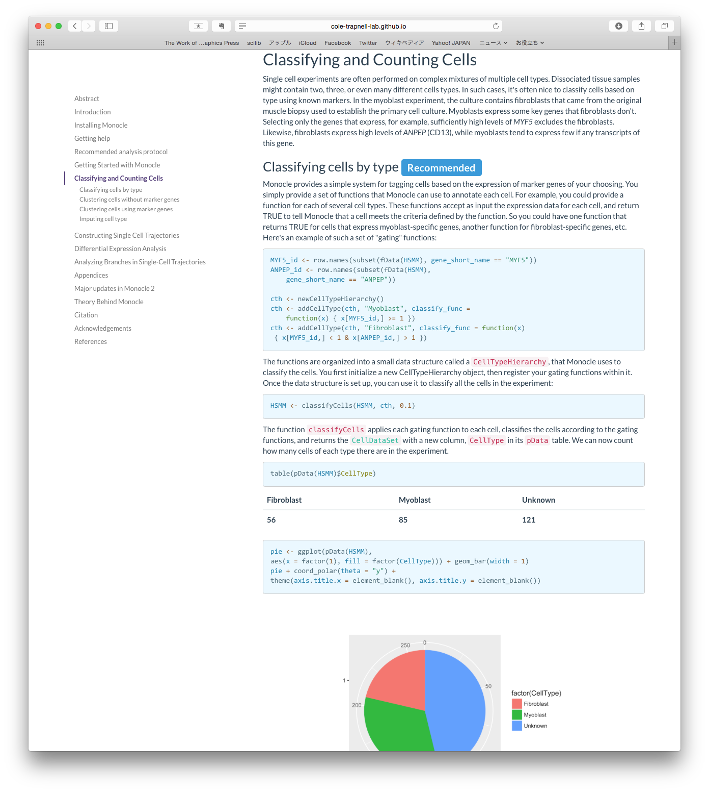 -->

<!-- #### ソフトウェアの選び方

性能がよいソフトウェア
性能はそのソフトウェアの論文や評価論文を読んで調べる
たいていソフトウェア論文を出していて、他のツールとの比較をしている
評価論文は“Evaluation”とか”Assessment”で検索すると出てくる
自分でベンチマーク（評価）する
みんなが使っているソフトウェア（≠最高性能のソフトウェア）
ノウハウが豊富なため、エラーが出たときなどに対処しやすい
あまり使われていないソフトウェアをあえて選ぶと、論文を書くときに「なぜわざわざそれを選んだか」を説明しないといけないこともある
 -->

### 小まとめ

- NGS解析にはウェブサービス, GUI, CUIという選択肢がある
  - CUIがよさそう
- NGS解析の３つの壁は乗り越えられる
  - バイオインフォ、NGS解析の知識の勉強
  - UNIXコマンドライン、スクリプト言語、Rの勉強
  - トラブルシューティングの方法の勉強


## 参考

- 書籍
  - 次世代シークエンサーDRY解析教本 https://www.amazon.co.jp/dp/4780909201
  - 次世代シークエンス解析スタンダード https://www.amazon.co.jp/dp/4758101914
  - Dr. Bonoの生命科学データ解析 https://www.amazon.co.jp/dp/4895929019
  - シングルセル解析プロトコール https://www.amazon.co.jp/dp/4758122342
  - 実験医学 2018年1月 Vol.36 No.1 どこでも　誰でも　より長く　ナノポアシークエンサーが研究の常識を変える！ https://www.amazon.co.jp/dp/4758125031
  - データ分析プロセス (シリーズ Useful R 2) https://www.amazon.co.jp/dp/4320123654
  - 戦略的データマイニング (シリーズ Useful R 4) https://www.amazon.co.jp/dp/4320123670
  - トランスクリプトーム解析 (シリーズ Useful R 7) https://www.amazon.co.jp/dp/4320123700
- ウェブ (日本語)
  - NGSハンズオン講習会の資料 https://biosciencedbc.jp/human/human-resources/workshop
  - コマンドライン講習会 http://cmdline.2016.class.kasahara.ws
  - (Rで)塩基配列解析 http://www.iu.a.u-tokyo.ac.jp/~kadota/r_seq.html
  - 統合TV（NGS解析だけでなくDBなども） http://togotv.dbcls.jp/
  - biopapyrus https://biopapyrus.jp
  - Heavy Watal https://heavywatal.github.io
  - Linux環境でのデータ解析：JavaやRの利用法 http://biosciencedbc.jp/human/human-resources/workshop/h28-2
  - Linux標準教科書 http://www.lpi.or.jp/linuxtext/text.shtml
- ウェブ (英語)
  - RNA-seqlopedia http://rnaseq.uoregon.edu/
  - EMBL-EBI のオンライントレーニング http://www.ebi.ac.uk/training/online/
  - R Bioconductor のチュートリアル http://bioconductor.org/help/course-materials/2016/BioC2016/

-----
----


<!-- できなかった話: permutation, NGS解析実況中継, http://www.iu.a.u-tokyo.ac.jp/~kadota/JSLAB_4_kadota.pdf, 戦略的データマイニングのような話, モチーフ解析, 行列分解系 -->
<!-- samtools, ファイルformat, 正規化, 層別 -->
<!-- giggle -->
<!-- 眺める必要がある、出てきた結果がただいいかを見極めるのは研究者の仕事、データの中身がわからないといい解析ができない; 一方で既存の知識によるバイアスにも注意  -->
<!-- みえた結果が偶然でないかを確かめるための統計学、最新の統計学的手法、使われる統計学の少数パターン -->
<!-- * FPKM と mean と 分散、TPM , （scRNA-seq） feature selection -->


<!--

#### 一細胞RNA-seq

まず以下の書籍をおすすめします。

- シングルセル解析プロトコール https://www.amazon.co.jp/dp/4758122342


##### 一細胞RNA-seqの基本手順

1. デマルチプレックス・トリミング
2. マッピング・定量化
3. 正規化
4. 特徴遺伝子抽出（特徴量抽出）
5. 次元圧縮・QC、クラスタリング、cell typing）


#### Oxford Nanopore のシーケンサー

まず以下の書籍をおすすめします。

- 実験医学 2018年1月 Vol.36 No.1 どこでも　誰でも　より長く　ナノポアシークエンサーが研究の常識を変える！ https://www.amazon.co.jp/dp/4758125031
 -->
