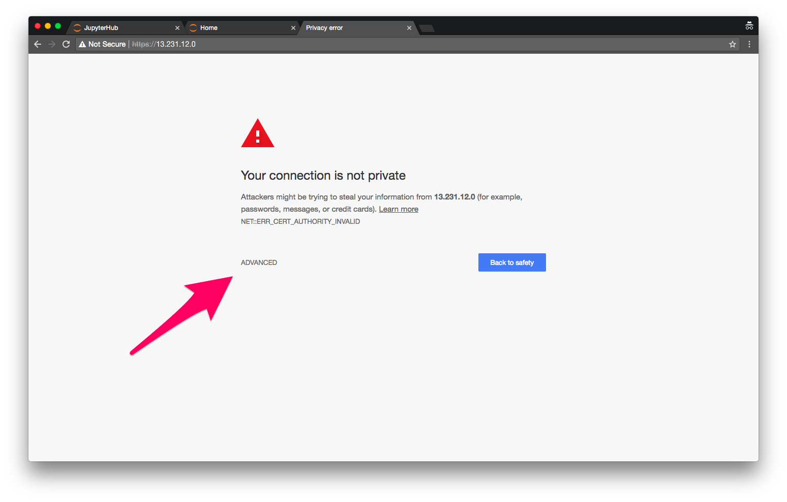
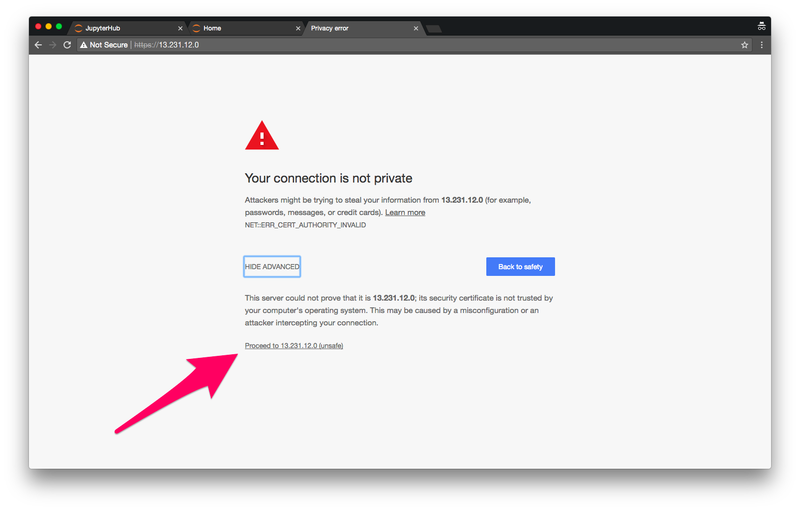
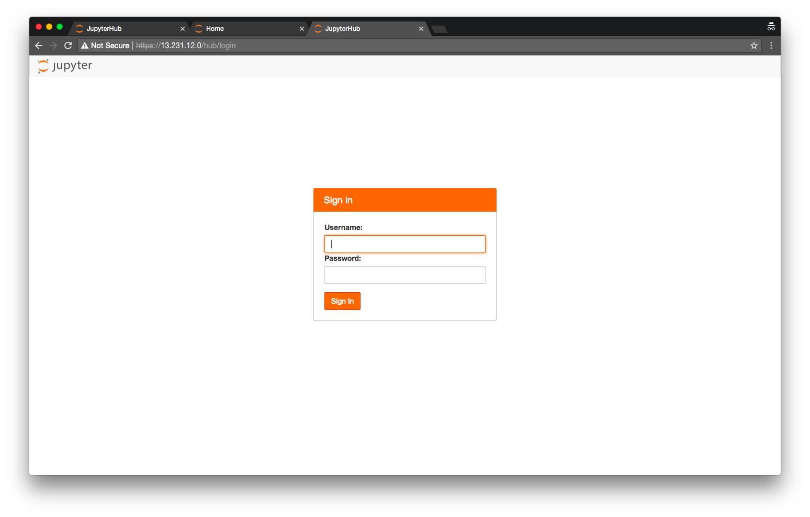
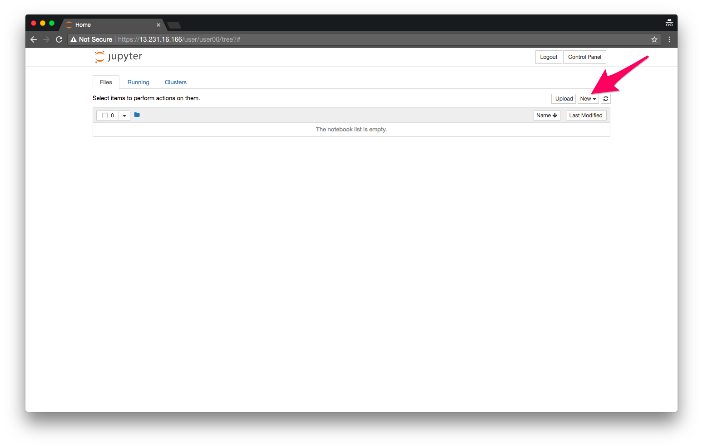
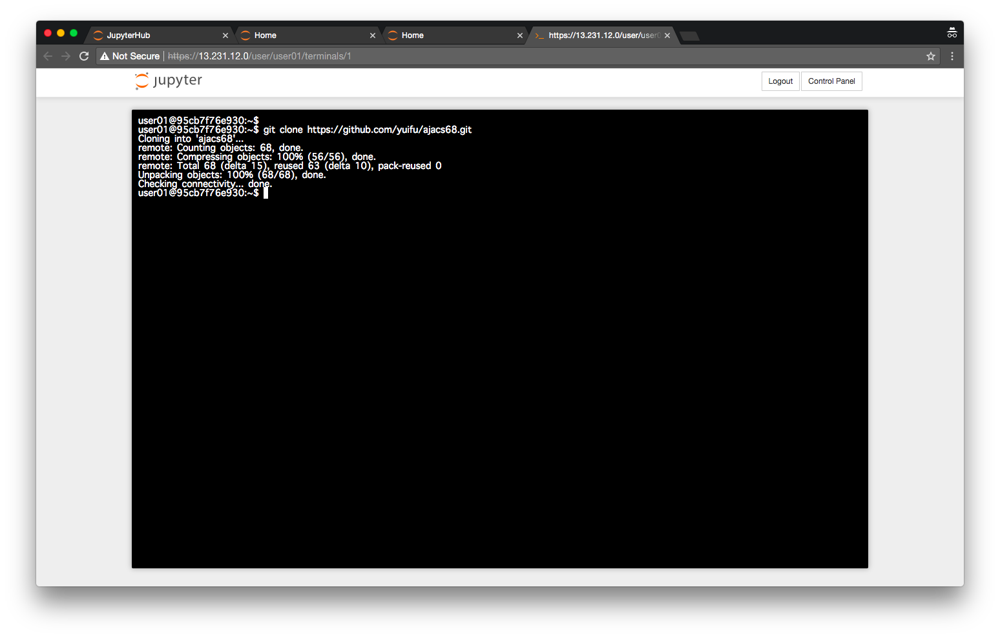
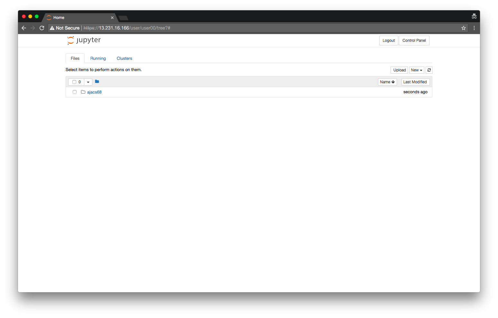

# 実習用環境の準備

AJACS68 (AJACS浜松) [https://events.biosciencedbc.jp/training/ajacs68](https://events.biosciencedbc.jp/training/ajacs68)  
January 17, 2018

尾崎 遼  
Haruka Ozaki  
haruka.ozaki@riken.jp | http://yuifu.github.io | [@yuifu](https://twitter.com/yuifu)

理化学研究所 情報基盤センター バイオインフォマティクス研究開発ユニット 基礎科学特別研究員  
Bioinformatics Research Unit, ACCC, RIKEN


----

## 概要

この文章では実習用環境の準備について説明します。

具体的には:

1. Jupyter notebook へのアクセス
2. 講習用データのダウンロード

実習用資料: https://github.com/yuifu/ajacs68

----


----

## 実習用環境の簡単な説明

Jupyter notebook はRを使うインターフェースの一つです。JupyterHubはたくさんのユーザに統一的なJupyter notebookの実行環境を提供するサーバーです。

受講者の皆さんは、JupyterHubにアクセスし、Jupyter notebookでRを使います。また、実習に使用するデータをダウンロードします。


## 方法
### 0. グループ分け

受講者に別々のグループとユーザIDの組み合わせを割り振ります

1. 自分の座っている座席の席番号（アルファベット＋数字）を確認します
2. `数字を5で割った余り + 1` をグループにします
    - グループ1 ~ グループ5
3. `user` + `アルファベットが（Aから数えて）何番目か（２桁）` をユーザIDとします


例:

- C-1なら グループ2で`user03`
- K-15 なら グループ1で`user11`


### 1. Jupyter notebook (JupyterHub) へのアクセス

まず `Chrome` を起動し、事前に割り当てられたグループに対応するURLへアクセスしてください。

- グループ1: https://13.230.209.214
- グループ2: https://13.230.149.203
- グループ3: https://13.112.218.14
- グループ4: https://54.250.215.28
- グループ5: https://52.199.110.150


アクセスすると下図のような画面が表示されます。`ADVANCED`をクリックしてください（下図、矢印）。



さらに、`Proceed to [IPアドレス] (unsafe)` をクリックします。



すると、下図のようなログイン画面がでてきます。事前に配布したユーザ名とパスワードを入力して `Sign in` をクリックします。



下図の画面が出たらログイン成功です。


### 2. 講習用データのダウンロード

ターミナルを起動します。`New`をクリックするとメニューが表示されます。その中から`Terminal`をクリックします。




すると新しいタブでターミナル（黒い画面）が表示されます。

続いて、講習用のデータをダウンロードするコマンドを入力します。以下のコマンドを入力して `Enter` (もしくは`Return`)を押します。しばらく待って`Checking connectivity ... done` と表示されたら成功です。

```
git clone https://github.com/yuifu/ajacs68.git
```



さらに以下のコマンドを入力します。`ajac68`と出力されたら成功です。

```
ls
```


それでは最初のタブに戻ります。`ajacs68`というディレクトリが新たにできていると思います。




----
